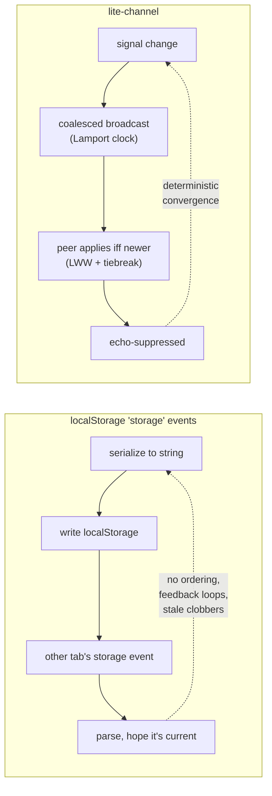
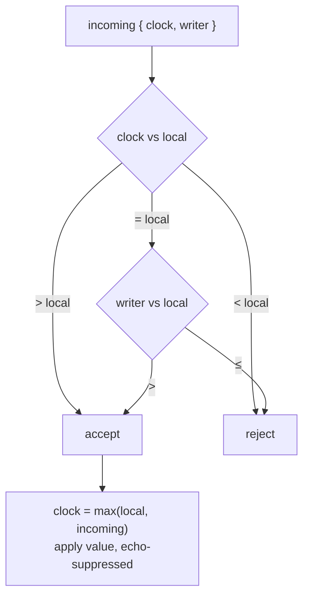

# @zakkster/lite-channel

[](https://www.npmjs.com/package/@zakkster/lite-channel)
[](https://bundlephobia.com/result?p=@zakkster/lite-channel)
[](https://www.npmjs.com/package/@zakkster/lite-channel)
[](https://www.npmjs.com/package/@zakkster/lite-channel)
[](https://github.com/PeshoVurtoleta/lite-signal)

[](https://opensource.org/licenses/MIT)

**Synchronize `@zakkster/lite-signal` state across browser tabs over `BroadcastChannel` — with deterministic conflict resolution and presence (peer count, leader election, connection status) exposed as reactive signals.**

Write to a signal in one tab; every other tab on the same origin converges to the same value. Concurrent writes from two tabs resolve to one deterministic winner — no divergence, no "last one to load wins". And because the sync layer's own state (*how many tabs are open, am I the leader, am I synced yet*) is itself a set of signals, your UI reacts to the cluster the same way it reacts to data.

```js
import { signal } from '@zakkster/lite-signal';
import { syncSignal } from '@zakkster/lite-channel';

const theme = signal('dark');

// That's it — `theme` is now shared across every tab on this origin.
const tab = syncSignal(theme, 'app:theme');

// Presence is reactive:
import { effect } from '@zakkster/lite-signal';
effect(() => console.log(`${tab.peers()} other tab(s), status: ${tab.status()}`));

theme.set('light');   // instantly reflected in all other tabs
```

---

## Contents

- [Why](#why) · [What it is / is not](#what-it-is--is-not) · [Install](#install) · [Quick start](#quick-start)
- [How it works](#how-it-works)
- [The conflict model (and the bug it avoids)](#the-conflict-model)
- [Presence as signals](#presence-as-signals)
- [Multiplexing & scheduling](#multiplexing--scheduling)
- [API reference](#api-reference)
- [Testing (for clients & QA)](#testing-for-clients--qa)
- [Running the demo](#running-the-demo)
- [Compatibility](#compatibility)
- [Edge cases & guarantees](#edge-cases--guarantees)
- [FAQ](#faq) · [License](#license)

---

## Why

Multi-tab apps leak state. A user opens your dashboard in three tabs, changes a setting in one, and the other two are now stale — or worse, the next time one of them autosaves, it clobbers the change with its old value. The usual "fix" is a `storage` event listener bolted onto `localStorage`, which gives you a stringly-typed firehose with no conflict handling and a feedback loop you have to debounce by hand.

If your state already lives in a reactive graph, the clean move is to make *the signal itself* tab-aware. `lite-channel` listens to a signal, broadcasts its changes over `BroadcastChannel`, applies inbound changes back into the signal, and resolves conflicts with a proper last-writer-wins register. The signal's consumers — your computeds, effects, and rendered UI — don't know or care that a value arrived from another tab.



---

## What it is / is not

- **It is** a ~200-line layer that binds writable signals to a `BroadcastChannel`, with a CRDT last-writer-wins register per key, cold-start handshake, echo suppression, reactive presence, and an optional `localStorage` snapshot fallback.
- **It is not** a server-sync / offline-replication engine. It synchronizes tabs of the **same origin on the same device**. It is not WebSocket sync, not Yjs/Automerge, not a database. For multi-*user* collaboration you want a real CRDT library and a server; this is for multi-*tab* consistency.
- **It is not** a deep-merge engine. Each key is a single LWW value. Two tabs editing *different fields of the same object* will not merge — the later write wins the whole object. Split independent fields into separate keys if you need them to move independently.

---

## Install

```bash
npm i @zakkster/lite-channel @zakkster/lite-signal
```

`@zakkster/lite-signal` is a **peer dependency** (`^1.1.0`) and must be the single shared instance — the synced signals are yours, created in your app's registry. ESM-only, ships TypeScript types.

```js
import { createTabSync, syncSignal } from '@zakkster/lite-channel';
```

---

## Quick start

Single signal:

```js
import { signal, effect } from '@zakkster/lite-signal';
import { syncSignal } from '@zakkster/lite-channel';

const count = signal(0);
const sync = syncSignal(count, 'demo:count');

document.querySelector('#inc').onclick = () => count.update(n => n + 1);
effect(() => render(count()));   // updates in every tab

// later: sync.dispose();
```

Many signals over one channel (recommended for real apps):

```js
import { createTabSync } from '@zakkster/lite-channel';

const bus = createTabSync('app');         // one BroadcastChannel
bus.sync(theme,   'theme');
bus.sync(filters, 'filters');
bus.sync(cart,    'cart');

effect(() => {
  statusDot.dataset.state = bus.status();         // "connecting" | "synced"
  peerBadge.textContent  = bus.peers();           // other tabs
});

// Run an exclusive job in exactly one tab:
effect(() => { if (bus.isLeader()) startPollingTheServer(); });
```

---

## How it works

A single `BroadcastChannel` carries four message types: `join`/`leave` (presence), `req` (a cold-starting tab asking for current state), and `state` (one or more key updates, also used to answer `req`). Each synced key is an independent **LWW register** tagged with a Lamport clock and the writer's tab id.

```mermaid
sequenceDiagram
    participant A as Tab A
    participant BC as BroadcastChannel
    participant B as Tab B (new)

    Note over B: createTabSync(); sync(sig, key)
    B->>BC: join
    B->>BC: req
    BC->>A: req
    A->>BC: state { snapshot, key, value, clock, writer }
    BC->>B: state → B adopts (it had no value yet)
    Note over A,B: now in sync

    Note over A: signal write
    A->>BC: state { key, value, clock+1, writer:A }
    BC->>B: apply iff (clock,writer) is newer; echo-suppressed
```

The write path is **echo-suppressed**: when an inbound update is applied to a signal, an internal flag tells that signal's broadcast subscriber to stay quiet, so a value can't ping-pong A→B→A. (This relies on lite-signal's synchronous subscriber dispatch — synced signals must use the default scheduler.)

The first time `syncSignal`/`sync` subscribes to a signal, lite-signal fires the subscriber **immediately** with the current value. `lite-channel` swallows that first invocation so binding a signal never spuriously broadcasts its initial value.

---

## The conflict model

Two tabs can write "at the same time". Without a total order, a naive `if (incoming > mine)` check makes both tabs reject each other and **diverge permanently** — each keeps its own value. The fix is a Lamport clock with a stable per-tab id as the tiebreaker, which gives a total order over writes:

> Accept a remote update **iff** `remote.clock > local.clock`, **or** `remote.clock === local.clock && remote.writer > local.writer`. On accept, take the `max` of the clocks; on a local write, increment.

That makes each key a CRDT LWW-register: every tab that applies the same set of updates ends in the **same** state, regardless of the order messages arrive. Concurrent writes resolve to the write from the higher tab id; the loser adopts it, and its next write (now at a higher clock) wins outright. This is pinned down by the `concurrent writes converge deterministically` test, which issues two simultaneous writes and asserts both tabs agree.



---

## Presence as signals

The cluster's own state is reactive, which is the point of building this on signals rather than as a bag of callbacks:

| Signal | Type | Meaning |
|---|---|---|
| `peers` | `ReadonlySignal<number>` | Count of **other** live tabs on the channel. |
| `status` | `ReadonlySignal<'connecting'\|'synced'>` | `connecting` until a snapshot arrives (or the readiness window elapses for a lone tab), then `synced`. |
| `isLeader` | `ReadonlySignal<boolean>` | `true` in exactly one tab — the live tab with the lowest id. Use it to gate singleton work (polling, a shared WebSocket). |
| `members` | `ReadonlySignal<string[]>` | Sorted live tab ids, including this tab. |

Presence is maintained by `join`/`leave` messages plus a heartbeat: a tab re-announces every `heartbeatMs`, and peers not heard from within `evictMs` are dropped (covers a crashed tab that never sent `leave`). Because these are signals, `effect(() => { if (isLeader()) … })` re-evaluates automatically when leadership changes hands.

---

## Multiplexing & scheduling

One `createTabSync` owns one `BroadcastChannel` and routes any number of keys over it — cheaper than a channel per signal and the only safe way to share a channel name across signals.

Outbound writes are **coalesced**: a burst of synchronous `.set()` calls collapses into a single broadcast carrying the final value. The flush is driven by an injectable scheduler:

```js
createTabSync('app', { schedule: (flush) => queueMicrotask(flush) }); // default
createTabSync('app', { schedule: (flush) => flush() });               // synchronous (tests)
```

Because the scheduler is just `(flush) => void`, you can drive broadcasts at **frame cadence** using `@zakkster/lite-raf` — handy when the synced value changes every frame (a shared cursor, a live camera position) and you want at most one cross-tab message per frame:

```js
import { rafEffect } from '@zakkster/lite-raf';
let pending = null;
const frameSchedule = (flush) => { pending = flush; };
rafEffect(() => { if (pending) { const f = pending; pending = null; f(); } });

createTabSync('app', { schedule: frameSchedule });
```

---

## API reference

### `createTabSync(channelName, options?) → TabSync`

| Option | Type | Default | Meaning |
|---|---|---|---|
| `schedule` | `(flush) => void` | `queueMicrotask` | Outbound flush scheduler. |
| `persist` | `boolean` | `true` | Mirror each key to `localStorage` for lone-tab cold start (values must be JSON-serialisable). |
| `heartbeatMs` | `number` | `2000` | Presence re-announce interval. `0` disables. |
| `evictMs` | `number` | `5000` | Drop a peer unheard-from this long. |
| `readyMs` | `number` | `150` | If no snapshot arrives in this window, a lone tab flips to `synced`. |
| `onError` | `(err) => void` | `console.error` | Sink for clone / storage failures. |

**Returns** a `TabSync`: `{ channelName, tabId, sync, peers, status, isLeader, members, dispose }`.

### `tabSync.sync(signal, key?) → { dispose }`

Bind a writable signal to `key` (default `"default"`; unique per channel — a duplicate throws). Returns a handle that unbinds just that key.

### `syncSignal(signal, channelName, options?) → handle`

Convenience for the single-signal case. Returns `{ dispose, peers, status, isLeader, members }` — the same presence signals, plus a combined `dispose`.

---

## Testing (for clients & QA)

```bash
npm test          # node --test test/*.test.js
```

**15 deterministic tests, no real timers or tabs required.** A synchronous in-process `BroadcastChannel` mock (`test/harness.js`) plus a synchronous flush scheduler mean every assertion runs *after* the cluster has converged. A `pause()`/`flush()` pair simulates true simultaneity for the race tests; the one eviction test uses node:test fake timers.

| Group | What's pinned down |
|---|---|
| Propagation | a local write reaches other tabs |
| Echo suppression | a remote-applied value is **not** re-broadcast (no A→B→A loop) |
| Conflict resolution | concurrent writes **converge** (Lamport + tab-id tiebreak); a strictly newer clock always wins |
| Cold start | a late tab catches up via the `req`/snapshot handshake, including never-written seed state |
| Multiplexing | independent keys; duplicate key throws |
| Presence | `peers` tracks join/leave; `isLeader` is deterministic; `status` flips on snapshot; silent peers are evicted |
| Persistence | a value rehydrates a fresh lone tab from `localStorage` |
| Lifecycle | `dispose` is idempotent and severs sync |
| Error isolation | a non-cloneable value routes to `onError` without crashing |

A clean run prints `# pass 15 / # fail 0`, exit code 0 — CI-ready. The **visual** check is the demo below: open it in two windows and confirm a change in one appears in the other, the peer count tracks windows opening/closing, and exactly one window shows the leader badge.

---

## Running the demo

```
example/demo.html
```

`BroadcastChannel` is scoped to a real origin, so serve the repo and open the page in **two browser windows/tabs**:

```bash
npx serve .
# open http://localhost:3000/example/demo.html in two tabs
```

Type in one tab and watch the other update live; the panel shows `peers`, `status`, `isLeader`, and `members` reacting in real time. (A `file://` origin is special-cased by browsers and may not share a channel — use a local server.)

---

## Compatibility

| Target | Library |
|---|---|
| Chrome / Edge / Firefox / Safari (modern) | ✅ |
| Node 18+ (BroadcastChannel is global) | ✅ |
| Web Workers / Service Workers | ✅ (same-origin) |
| `localStorage` persistence | optional; auto-skipped where unavailable |

`BroadcastChannel` is supported in all current browsers. Presence relies on `window` unload events (`pagehide`/`beforeunload`) to send `leave`; where those don't fire, the heartbeat eviction is the backstop.

---

## Edge cases & guarantees

- **Deterministic convergence.** Any set of tabs that processes the same updates ends in the same per-key state, independent of arrival order — the LWW-register property.
- **No echo loops.** Remote-applied writes are flagged so they never re-broadcast. Requires synchronous subscriber dispatch (the lite-signal default) — don't bind a signal whose subscriber is deferred.
- **No spurious mount broadcast.** The immediate subscriber fire on bind is swallowed; binding never leaks the initial value onto the wire.
- **Coalesced writes.** Rapid `.set()` bursts become one broadcast of the final value, per the `schedule` you choose.
- **Cold start.** A new tab requests a snapshot and adopts it even for never-written seed values; if it hydrated newer state from `localStorage`, that wins by clock.
- **Per-key granularity.** Each key is one LWW value; there is no field-level merge. Use separate keys for independently-edited fields.
- **Cloneability.** Values cross the wire via structured clone (and JSON for persistence). Non-cloneable payloads (functions, DOM nodes) route to `onError` rather than throwing into your write.
- **Same origin, same device only.** This is tab sync, not network sync.

---

## FAQ

**How is this different from a `localStorage` + `storage` event?**
`storage` gives you stringly-typed events with no ordering, no conflict resolution, and a feedback loop you debounce by hand. `lite-channel` gives typed structured-clone messages, a CRDT LWW register, echo suppression, presence, and leader election — and it binds directly to signals so consumers are oblivious.

**What happens on a true conflict?**
The higher tab id wins the tie at equal clocks; the loser adopts the winner's value. Deterministic, no divergence. If you need field-level merging, model fields as separate keys (or reach for a real CRDT lib — different problem).

**Does it work across different browsers or machines?**
No. `BroadcastChannel` is same-origin, same-browser, same-device. This is multi-*tab*, not multi-*user*.

**Can I sync a computed?**
No — only writable signals (a computed has no `.set`). Sync the underlying writable signals instead.

**Is the leader stable?**
The leader is the lowest live tab id. It only changes when that tab closes, at which point the next-lowest takes over and `isLeader` re-fires in that tab. There's no split-brain: id comparison is total.

**What if two tabs sync different sets of keys on one channel?**
Fine. A `req` snapshot only answers for keys the responder holds; `state` updates for unknown keys are ignored.

---

## License

MIT © Zahary Shinikchiev
